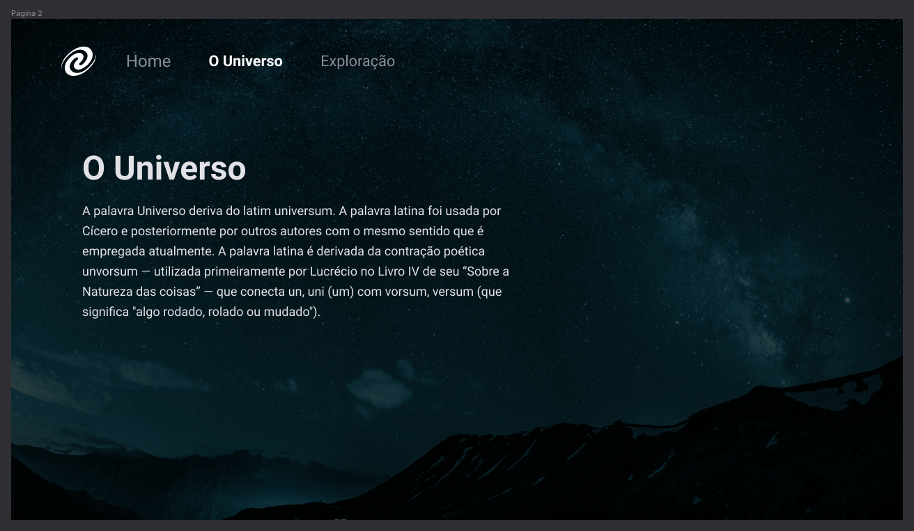

<h1 align="center"> Single Page Application Universe </h1>

<p align="center">
  <a href="#-tecnologias">Tecnologias</a>&nbsp;&nbsp;&nbsp;|&nbsp;&nbsp;&nbsp;
  <a href="#-projeto">Projeto</a>&nbsp;&nbsp;&nbsp;|&nbsp;&nbsp;&nbsp;
   <a href="#-layout">Layout</a>&nbsp;&nbsp;&nbsp;|&nbsp;&nbsp;&nbsp;
  <a href="#-layout">Documentação Lógica</a>&nbsp;&nbsp;&nbsp;
</p>

<br>

## 🚀 Tecnologias

Esse projeto foi desenvolvido com as seguintes tecnologias:

- HTML
- CSS
- JavaScript
- Figma

## 💻 Projeto

Neste desafio foi criado uma Single Page Application (SPA). Temas aplicados:

- Funções no Javascript
- SPA (Single Page Application)
- Manipulação da DOM
- Funções
- ESModules
- Clean Code
- States
- Router
- Responsividade
- Node
  
## 📝 Proposta
<p align="center">
  
</p>

## 🔖 Layout
Você pode visualizar o layout do projeto através [DESSE LINK](https://www.figma.com/file/mWWxLYCbpmM3rMqWB7lKV8/Stage-05-Focus-Timer-2.0-Copy?fuid=1369823793362288511)

## 💻 Iniciar o projeto
Clone o repositório na sua máquina pelo comando: 
```
git clone https://github.com/DevBonatto/SPA-Universe.git
```
em seguida, execute esse comando no terminal do projeto:
```
npm install
```
por último, inicie o projeto pelo comando:
```
npm start
```

## 📄 Documentação Lógica
[CLIQUE AQUI]() para ver a documentação lógica do projeto.
